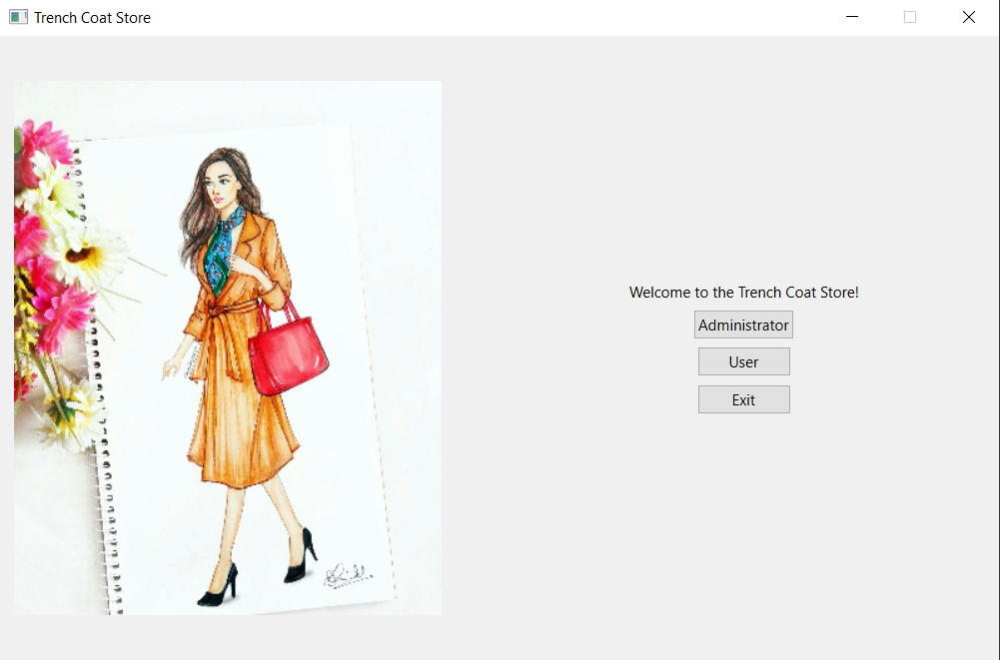

# Trench Coat Store

This is an assignment project done in **C++** for the OOP course during my 1st year of CS Bachelor.

My task was to implemented a trench coat store which is developed according to the **OOP paradigm**, using **layered architecture**. It can be used in two modes: *admin* and *user*.
- Admins can: perform CRUD operations on the coats repository and in case they change their mind, they can revert and redo any of their action. They can also perform filtering on the storeroom items.
- Users can: iterate the coats offer in a sorted way, if they fancy (by price or by size), search coats of a specific size, add coats to their baskets and then check its contents and the total price of the added items.

The GUI is implemented using the **Qt framework**. Some of it I coded manually, some using Qt Designer. The basket window is based on the **model-view architecture**, using Qt's very handy API in this sense.

#### Main window:

#### Admin window:

#### User window:

#### Basket window:

